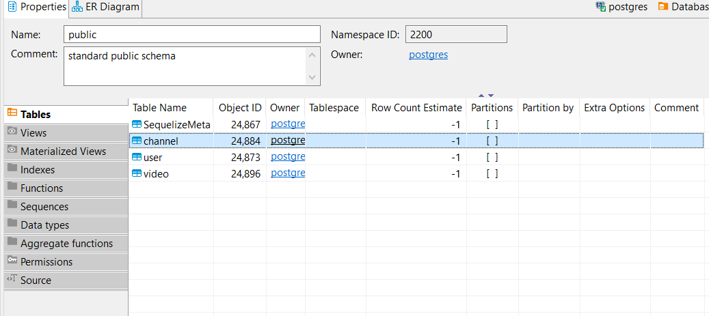
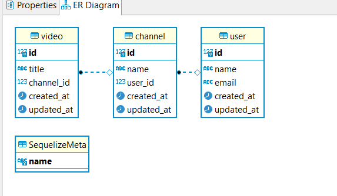
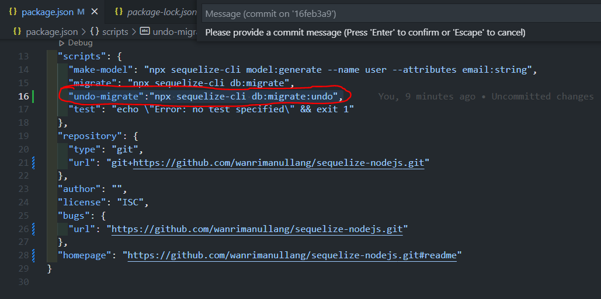
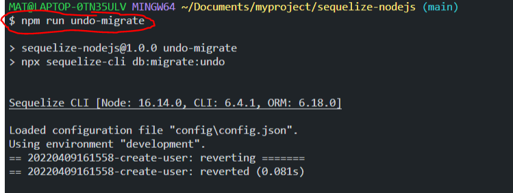
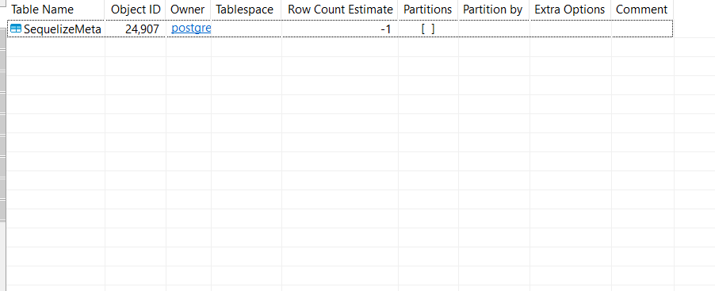

# sequelize-nodejs

<h1> tutorial install sequelize </h1>
<h3>install --save-dev sequelize-cli</h3> 

syntax ini untuk membuat package-lock.json dan package.jso dan menginstall library yang berkaitan dengan sequelize. 

<h3>npx sequelize-cli init</h3> 
<h3>npm init</h3> 
<h3>npm install pg --save</h3> 

membuat author pada package.json

membuat folder yang dibutuhkan dalam konfigurasi nanti ke database terdiri dari : 
 
<ul>
    <li>config : sebagai konfigurasi ke database.</li>
    <li>migrations : sebagai pembuatan kolom ke database.</li>
    <li>models : konfigurasi sequelize.</li>
    <li>seeders : memasukkan data secara otomatis kedalam database.</li>
</ul>
<h3>membuat database sesuaikan dengan username, password, database name. noted : saya disini menggunakan database postgres.
<h3>konfigurasi config.json berada pada folder config : </h3>
{
  "development": {
    "username": "postgres",
    "password": "admin",
    "database": "sequelize_tutorial",
    "host": "127.0.0.1",
    "dialect": "postgres"
  },
  "test": { 
    "username": "postgres",
    "password": "admin",
    "database": "sequelize_tutorial",
    "host": "127.0.0.1",
    "dialect": "postgres"
  },
  "production": {
    "username": "postgres",
    "password": "admin",
    "database": "sequelize_tutorial",
    "host": "127.0.0.1",
    "dialect": "postgres"
  }
}
<h3>npx sequelize-cli model:generate --name User --attributes email:string</h3> 

generate untuk tabel User yang dimana isi nya ada coloumn email dengan tipe data String

generate otomatis jadi ada di folder models dan migrations

atur untuk kolom yang di inginkan. kalo saya ingin membuat kolom email tidak boleh kosong dan harus unik noted : diatur dalam migrations

<h3>Membuat beberapa kolom. sebagai berikut : </h3> 
<ul>
    <li>kolom user : row id, nama, dan email </li>
    <li>movie : row id, name,dan user_name </li>
    <li>video : row id, title.</li>
</ul>
<h3>Mengganti dropall table</h3> 

before : await queryInterface.dropTable('Users');
  

after : await queryInterface.dropAllTables();
 
<h3>Menambahkan script debug pada Package.json </h3> 

pada penambahan ini dilakukan agar mempermudah dalam pemanggilan script sequelize. untuk script yang dimasukkan kedalam package.json ada 2 yaitu :

 
"make-model": "npx sequelize-cli model:generate --name user --attributes email:string",

 
"migrate": "npx sequelize-cli db:migrate",

 
jadi pada saat nanti pemanggilan hanya cukup mengetikkan "npm run migrate" atau "npm run make-model"

<h3>lalu lihat kolom database (refresh) kalian.BOOM!!<h3>
 
 

oke kita udah bisa memasukkan tabel-tabel yang kita inginkan, sekarang kita membuat studi kasus jika pada saat kita mengalami masalah dalam penginputan ehh ternyata untuk table nya ada yang kurang atau untuk type data nya ada yang salah. kita bisa melakukan undo sebagai berikut.

<h3>undo migrate<h3> 

memasukkan script untuk ke dalam package.json : "undo-migrate":"npx sequelize-cli db:migrate:undo", => jadi saat kita ingin undo hanya tekan "<b>npm undo -migrate</b>"
 
 
berikut adalah penyimpanan script untuk undo

berikut adalah pada saat menjalankan comment untuk undo

BOOM! database pun tidak ada kolom lagi

